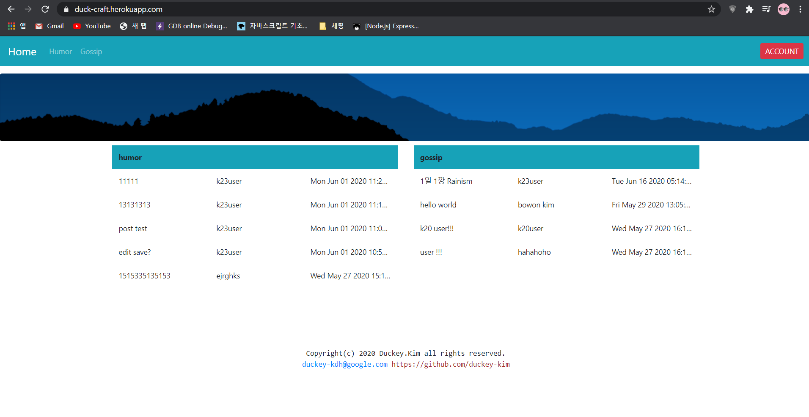

# duck-craft

유저들이 작성한 짤(밈)등을  저장하고 게시하는 웹페이지

## 프로젝트 소개

HTML,CSS을 이해하고 `Bootstrap 4`을 이용하여 웹페이지를 만듬 ,`EJS`템플릿을 이용하였고, `Node.js` 서버를 통해 Google Firebase 의 데이터를 가져온다

`Cookie`을 이용해 사용자 로그인 확인하였고  ,유저가 작성한 글을 Google Firebase의 `Cloud-Firestore`에 저장하였다.


## Prerequisite

- Bootstrap >= 4.4.1
- Express >= 4.17.1
- NodeJs >= 13.12.0
- Ejs >= 3.0.2
- express-ejs-layouts >= 2.5.0  
- cookie-parser >= 1.4.5  

## Prerequisite Installation

필요한 자원들은 인터넷 또는 npm을 사용하여 다운받을 수 있다.  
**NodeJs** : 인터넷으로 다운로드 **[NodeJs](https://nodejs.org/ko/download/)**  
**Bootstrap** : 인터넷으로 다운로드 **[Bootstrap](https://getbootstrap.com/docs/4.4/getting-started/download/)**

NPM을 사용하여 다운로드

```shell script
npm install bootstrap  --save
```

**ExpressJs** : NPM을 활용하여 다운로드(NodeJs설치가 된 상태)

이제 project 디렉토리에 Express를 설치한 후 종속 항목 목록에 저장하십시오.

```shell script
npm install express --save
```

**Ejs** : NPM을 사용하여 다운로드

```shell script
npm install ejs --save
```

**다운받은 파일 package하기**  
npm init 명령을 이용하여 애플리케이션에 대한 package.json 파일을 작성하십시오

```shell script
npm init
```
